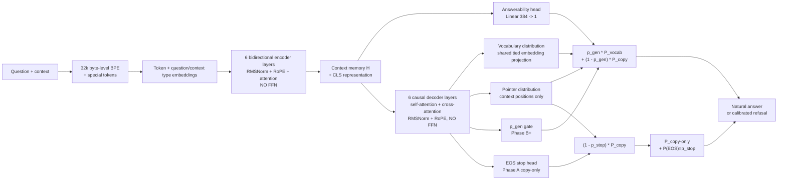

# `attn_pg_23m_v1`

The redo model is an encoder-decoder pointer-generator trained from scratch.
It is intentionally not the old causal GPT-style checkpoint.



## Exact configuration

| Field | Value |
|---|---:|
| Vocabulary | 32,000 byte-level BPE tokens |
| Encoder / decoder | 6 / 6 layers |
| Hidden size | 384 |
| Heads / head dimension | 6 / 64 |
| FFN | None in encoder or decoder |
| Normalization | RMSNorm, epsilon `1e-5` |
| Position encoding | RoPE, theta `10000` |
| Dropout | `0.10` |
| Initial source / target length | 512 / 64 tokens |
| RAG source length | 1024 tokens |
| Parameters | 23,210,115 |

The measured parameter breakdown is:

```text
shared token embedding   12,288,000
token type embedding             768
encoder attention          3,541,248
decoder attention          7,082,496
RMSNorm                         768
pointer                     296,065
stop head                      385
answerability                  385
total                    23,210,115
```

## Encoder

The source is formatted as:

```text
<CLS> <Q> question <SEP> <CTX> context <EOS>
```

The encoder adds token and question/context type embeddings. Each layer is:

```text
x = x + MultiHeadAttention(RMSNorm(x))
```

Attention is bidirectional over valid source positions. The context-copy mask
is separate from the token types and marks only actual context text, excluding
question text, markers, EOS, and padding.

## Decoder

The decoder starts with `<BOS>` and is trained with teacher forcing. Each layer
is:

```text
x = x + causal_self_attention(RMSNorm(x))
x = x + cross_attention(RMSNorm(x), encoder_memory)
```

There is no token-wise feed-forward transformation. The decoder output shares
the encoder embedding matrix for vocabulary projection.

## Pointer-generator

For every target position, dedicated pointer projections score decoder state
against every encoder memory position. Scores are masked to context tokens and
normalized over positions. Repeated source token IDs are summed into one copy
probability. The gate combines copying and vocabulary generation:

```text
P_final(token) = p_gen * P_vocab(token)
                 + (1 - p_gen) * P_copy(token)
```

The gate is learned from sequence likelihood; the current implementation does
not hard-code copy labels for numbers or entities. During Phase A v2, the
vocabulary path and `p_gen` are ignored entirely. A separate `384 -> 1` stop
head reserves probability for EOS:

```text
P_final = (1 - p_stop) * P_copy
P_final[EOS] = p_stop
```

## Answerability

The final encoder `<CLS>` representation goes through `Linear(384 -> 1)`. In
the later refusal phases, this head decides whether to run the decoder. A
negative example receives answerability BCE only; it does not receive a fake
refusal sequence target. The refusal threshold is calibrated after Phase D,
not assumed to be `0.5`.

## Phase A v2 result

The 1,000-step copy-only probe passed literal copying on same-template,
unseen-entity rows (90.6% generated EM; 93.5% pointer token accuracy), but
failed held-out language and random access-code probes. The model therefore
does not yet pass the Phase A generalization gate. The run is recorded at
[W&B run hai3wnwa](https://wandb.ai/tomartarun2001-adobe/grounded-attn-qa/runs/hai3wnwa).

## Current boundary

The model can paraphrase because vocabulary generation remains available, but
the architecture does not mathematically guarantee factuality. Grounding is
measured with unsupported-number/entity checks, context overlap, pointer
diagnostics, counterfactual probes, and no-context leakage tests.
